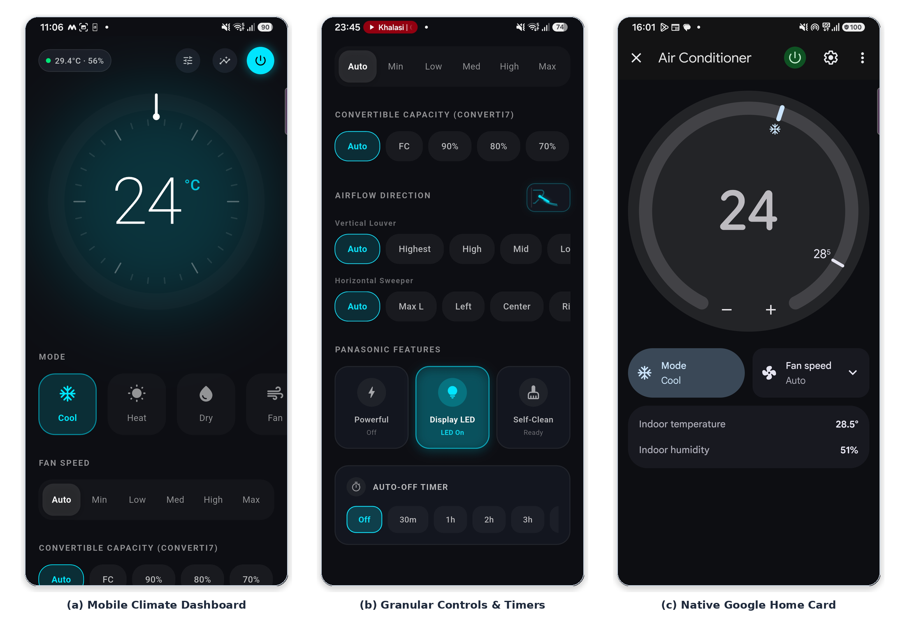

# Ventra Universal Smart AC Ecosystem

[](https://flutter.dev)
[](https://www.espressif.com/)
[](https://fastapi.tiangolo.com/)
[](https://mqtt.org/)
[](https://developers.home.google.com/)
[](LICENSE)

**Ventra** is an end-to-end, production-grade IoT climate control ecosystem that retrofits legacy split-unit and inverter air conditioners into cloud-connected smart appliances. 

It combines a **custom ESP32 hardware hub** with infrared learning and multi-brand transmission, a **cloud-native FastAPI backend** featuring bidirectional WebSockets and Google Assistant smart home integration, and a **modern Material 3 Flutter mobile application** with in-app Bluetooth Low Energy (BLE) Wi-Fi provisioning.

---

## System Showcase



*Figure: Complete ecosystem integration showing physical ESP32 hub breadboard, live terminal telemetry monitor, and the production Material 3 Flutter dashboard.*

---

## Architecture Overview

Ventra operates as a tightly integrated, local-first IoT triad:

```
                            +-----------------------------------+
                            |       Google Assistant Cloud      |
                            |   (Google Home Graph Integration) |
                            +-----------------+-----------------+
                                              |
                             OAuth2 / SYNC    | EXECUTE
                                              v
+------------------------+          +-----------------------------------+
|  Flutter Mobile App    |  WSS /   |        Ventra Cloud Backend       |
|  (Android / iOS / Web) |<-------->|   (FastAPI + Async MQTT Bridge)   |
|  - Material 3 Controls |  HTTPS   |   - 35s Hub Watchdog Timer        |
|  - Rotary Temp Dial    |          |   - State Delta Synthesizer       |
|  - Real-Time Analytics |          |   - SQLite Timeseries Telemetry   |
|  - In-App BLE Setup    |          +-----------------+-----------------+
+-----------+------------+                            |
            |                                         | MQTT (TCP 1883)
            | BLE 5.0 GATT                            | Topics: ventra/cmd
            | (Provisioning)                          |         ventra/telemetry
            v                                         v         ventra/status
+-----------------------------------------------------------------------+
|                       Physical ESP32 Edge Hub                         |
|  - FreeRTOS + NimBLE Stack (Non-destructive Wi-Fi Provisioning)       |
|  - 38 kHz Carrier IR Blaster (NPN Transistor Driver on GPIO 4)        |
|  - TSOP1838 IR Receiver for Protocol Learning (GPIO 15)               |
|  - DHT22 Precision Temperature & Humidity Telemetry (GPIO 26)         |
|  - HC-SR501 PIR Motion Sensor with Interrupt Latching (GPIO 27)       |
+-----------------------------------+-----------------------------------+
                                    |
                        38 kHz IR   | (Panasonic converti7 16B /
                        Pulses      |  Gree 8B / Universal Codes)
                                    v
                     +-----------------------------+
                     |   Split / Inverter AC Unit  |
                     +-----------------------------+
```

### Detailed System Diagrams
- **[Full Block Diagram](docs/architecture/block_diagram.png)**: High-resolution schematic illustrating hardware layers, cloud services, and client communication.
- **[System Execution Flowchart](docs/architecture/flow_chart.png)**: Step-by-step state machine showing telemetry ingestion, watchdog handling, and command synthesis.

---

## Core Capabilities

### 1. Modern Material 3 Mobile Dashboard (`lib/`)
- **Rotary Temperature Dial**: Interactive 360° circular slider with tactile feedback, precise clamping, and animated color transitions reflecting heating, cooling, or dry modes.
- **Animated Louver Visualization**: Dynamic SVG-based air louver displaying real-time swing states (Auto, Fixed angles 1 to 5) synced with physical AC registers.
- **Telemetry & Control Decoupling**: Separate data pipelines for sensor telemetry and AC control state, completely eliminating UI snap-backs and race conditions.
- **24-Hour Environmental Analytics**: Bottom sheet with interactive charts displaying ambient room temperature, relative humidity, and motion events over time.
- **In-App BLE Wi-Fi Provisioning**: Scan for nearby hubs over Bluetooth Low Energy, view discovered 2.4 GHz Wi-Fi networks, and securely push network credentials directly from the app.

### 2. Multi-Brand Infrared Engine & Protocol Reverse-Engineering
- **Panasonic Inverter AC (`PANASONIC_AC`)**: Reverse-engineered 16-byte framing with checksum synthesis supporting discrete temperature ($16^\circ\text{C}$–$30^\circ\text{C}$), fan speeds, vertical swing positions, Auto-Clean toggle, Display LED toggling, and proprietary **`converti7` capacity modes** (Step 0 = Normal, Step 1 = 110%, Step 2 = 90%, Step 3 = 80%, Step 4 = 70%, Step 5 = 55%, Step 6 = 40%).
- **Gree AC (`GREE_AC`)**: 8-byte frame generation supporting heating/cooling modes, horizontal/vertical swing combos, I-Feel, Turbo, Sleep, and X-Fan blower drying.
- **Universal Brand Catalog**: Dynamic catalog supporting Daikin, Mitsubishi, LG, Samsung, Voltas, Blue Star, Carrier, Whirlpool, Haier, and Hitachi.
- **Gated Learning Mode**: On-demand TSOP1838 capture mode with optical loopback suppression to prevent self-triggering during transmission.

### 3. Cloud Backend & MQTT Bridge (`server/`)
- **Sub-50ms Control Latency**: Bidirectional WebSockets (`/ws`) multiplex command dispatch and telemetry broadcasting.
- **35-Second Liveness Watchdog**: Automated background task continuously validates device heartbeats, resetting offline states upon network degradation.
- **Full Delta Synthesizer**: Merges partial client updates (e.g. changing only fan speed) with last-known device states to produce complete, valid IR transmission packets.
- **Google Home Graph Integration**: Full fulfillment for `action.devices.types.AC_UNIT` with `action.devices.traits.TemperatureSetting` and `action.devices.traits.OnOff`, complete with local OAuth2 token issuance (`/oauth/auth`, `/oauth/token`).
- **Resource Efficient**: Operates under native Python 3 with Uvicorn, consuming less than 20 MB RAM.

### 4. ESP32 Firmware (`firmware/`)
- **Non-Destructive BLE Lifecycle**: Uses lightweight NimBLE to enable on-demand Wi-Fi reconfiguration without de-initializing the Bluetooth stack or causing radio coexistence panics.
- **Asynchronous Reconnection State Machine**: Exponential backoff reconnects to Wi-Fi and MQTT without blocking the FreeRTOS main loop.
- **Latched Interrupt PIR Motion Sensing**: Thread-safe ISR captures room occupancy pulses instantly, delivering room activity tracking.

---

## Hardware Pinout & Bill of Materials

| Peripheral | Component | ESP32 GPIO | Operating Voltage | Purpose |
|---|---|---|---|---|
| **IR Transmitter** | 940 nm High-Power IR LED + 2N2222 Transistor | `GPIO 4` | 5V VCC / 3.3V Base | Modulated 38 kHz Carrier IR Blaster |
| **IR Receiver** | TSOP1838 Photodetector | `GPIO 15` | 3.3V | Protocol learning & remote reverse-engineering |
| **Environmental Sensor**| DHT22 / AM2302 Sensor | `GPIO 26` | 3.3V | Room temperature ($\pm 0.5^\circ\text{C}$) & humidity ($\pm 2\%$) |
| **Motion Detector** | HC-SR501 PIR Sensor | `GPIO 27` | 5V VCC / 3.3V OUT | Passive infrared human presence detection |
| **Status LED** | Onboard SMD LED | `GPIO 2` | 3.3V | Hub connection and network health indicator |

---

## Repository Structure

```
.
├── lib/                             # Flutter Mobile Application
│   ├── main.dart                    # Application bootstrap & route registration
│   ├── screens/
│   │   ├── ac_remote_dashboard.dart # Main hub dashboard & state coordination
│   │   ├── panasonic_view.dart      # Panasonic-specific converti7 & clean controls
│   │   └── gree_view.dart           # Gree-specific swing, I-Feel & Turbo controls
│   ├── theme/                       # Material 3 color palettes and typography
│   └── widgets/
│       ├── temperature_dial.dart    # Interactive circular rotary temperature dial
│       ├── animated_louver.dart     # Directional air louver visualizer
│       ├── ble_provisioning_sheet.dart # In-app Bluetooth LE setup modal
│       └── analytics_sheet.dart     # 24-hour environmental sensor telemetry graph
│
├── firmware/                        # ESP32 C++ PlatformIO Firmware
│   ├── platformio.ini               # Build configuration, flags & dependencies
│   ├── huge_app.csv                 # Custom 3MB app partition table (supports BLE+WiFi)
│   ├── include/
│   │   └── config.h                 # Hardware pinouts, topics, and timing constants
│   ├── src/
│   │   └── main.cpp                 # Firmware main loop, NimBLE, IRremote & MQTT
│   └── docs/
│       └── PANASONIC_PROTOCOL_RE.md # Reverse-engineering documentation for Panasonic
│
├── server/                          # FastAPI Backend & MQTT Bridge
│   ├── app.py                       # Asynchronous FastAPI app, WebSockets & MQTT bridge
│   ├── requirements.txt             # Python dependencies
│   ├── ventra-api.service           # Production systemd service unit
│   └── README.md                    # Server deployment & configuration guide
│
├── docs/                            # Documentation & Architectural Schematics
│   ├── architecture/
│   │   ├── block_diagram.png        # System architecture diagram
│   │   ├── flow_chart.png           # Execution state machine flowchart
│   │   └── ecosystem_showcase.png   # Three-panel hardware and software showcase
│   └── SERVER_SETUP.md              # Cloud deployment, Caddy reverse-proxy & SSL guide
│
└── scripts/                         # Protocol Verification & Diagnostic Utilities
    └── cycle_converti7.py           # Automated test harness for Panasonic capacity steps
```

---

## Quickstart Guide

### 1. Flutter Mobile App
```bash
# Clone the repository
git clone https://github.com/Bhavyashah94/AC_Remote_Flutter.git
cd AC_Remote_Flutter

# Fetch dependencies
flutter pub get

# Run on a connected Android / iOS device
flutter run
```

### 2. ESP32 Firmware
```bash
cd firmware

# Build and flash using PlatformIO
pio run -t upload

# Open serial monitor (115200 baud)
pio device monitor -b 115200
```

### 3. Backend Cloud Server
```bash
cd server

# Create and activate virtual environment
python3 -m venv venv
source venv/bin/activate

# Install dependencies
pip install -r requirements.txt

# Run server with Uvicorn
uvicorn app:app --host 0.0.0.0 --port 8000 --reload
```

---

## Cloud Deployment

For production setups using Oracle Cloud, AWS, or DigitalOcean:
- Review the comprehensive guide in **[docs/SERVER_SETUP.md](docs/SERVER_SETUP.md)** for Mosquitto setup, systemd service installation, and Caddy reverse proxy with automatic Let's Encrypt TLS.

---

## License

This project is licensed under the MIT License — see the [LICENSE](LICENSE) file for details.
